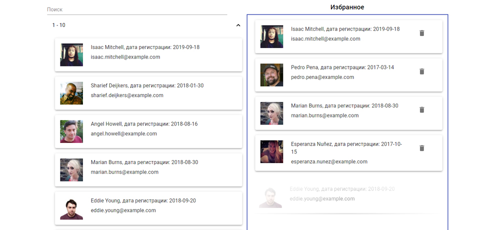

# [Cписок пользователей](https://agants.github.io/user-base/)

## Функциональность:

* Cписок из 5000 пользователей, сортированных по дате регистрации
* Группы пользователей можно независимо раскрывать и закрывать
* Поиск ищет пользователей по имени и фамилии или вхождением подстроки
* Пользователей можно перемещать в список «Избранные» с помощью Drag&Drop 
* API https://randomuser.me/
* Для хранения и передачи данных используется Contex